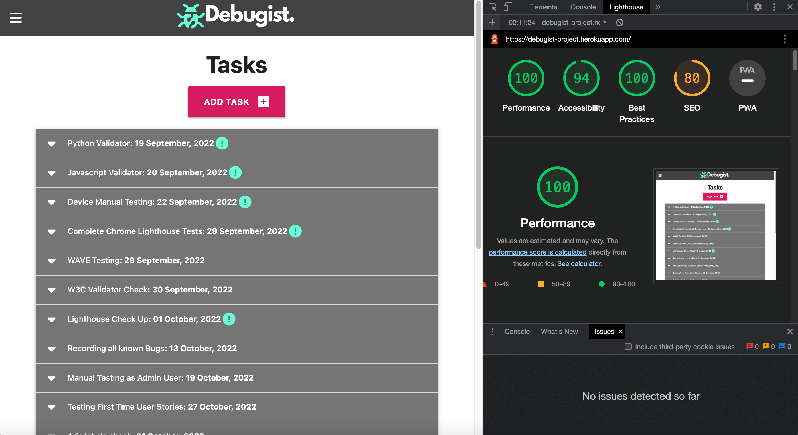
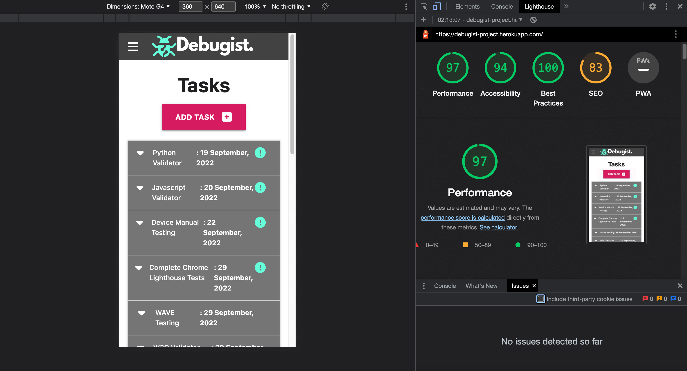

# Debugist -  Testing

Visit the deployed site: [Debugist](https://debugist-project.herokuapp.com/)

- - -

## CONTENTS

* [AUTOMATED TESTING](#AUTOMATED-TESTING)
    * [W3C Validator](#W3C-Validator)
    * [JavaScript Validator](#JavaScript-Validator)
    * [Python Validator](#Python-Validator)
    * [Lighthouse](#Lighthouse)
    * [WAVE Testing](#WAVE-Testing)
* [MANUAL TESTING](#MANUAL-TESTING)
    * [Testing User Stories](#Testing-User-Stories)
    * [Full Testing](#Full-Testing)
* [BUGS](#Bugs) 

Testing was ongoing throughout the build. I utilised Chrome developer tools whilst building to pinpoint and troubleshoot any issues as I went along.

I used the console in the developer tools to work through sections of code and ensure that it was working correctly, and also troubleshoot where needed.

I have gone through each page using google chrome developer tools to ensure that each page is responsive on a variety of different screen sizes and devices.

---

## AUTOMATED TESTING

### W3C Validator

[W3C](https://validator.w3.org/) was used to validate the HTML on all app pages. It was also used to validate the CSS file.

* tasks.html 
* register.html 
* login.html 
* profile.html 
* projects.html  
* add_project.html  
* edit_project.html 
* add_task.html  
* edit_task.html   

  * HTML:
  Get one warning for the 'flash banner' section, recommends to use a heading or change to a div from a 'section'.

  * CSS: 
  Warnings given for CDN linked libraries from FontAwesome and MaterializeCSS. These warnings did not affect linked elements I was using from those libraries. 

---

### JavaScript Validator

[JSHint](https://jshint.com/) was used to validate the JavaScript.
I used the jshint extension I had installed into my Visual Studio Code IDE. 

No warnings given for the script.js file.

---

### Python Validator 

[PEP8 Online](http://pep8online.com/) was used to validate all Python files.

Due to limited time for completing the project, unfortunately I was unable to finish fixing all PEP8 errors that were shown. 

I need to spend more time on this and confirm solutions around the errors showing for backslashes within brackets, also how to be best line break code over multiple lines. 

---

### Lighthouse

Google Lighthouse within the Chrome Developer Tools was used to test for performance, accessibility, best practices and SEO.

Most performance issues related to the MaterializeCSS library, I would like to spend more time on this to figure out how it can be improved upon. 

### Desktop Results

Results for desktop.

### Mobile Results

Results for mobile. 

---

### WAVE Testing 

[WAVE](http://wave.webaim.org/) (Web Accessibility Evaluation Tool) This tool allows developers to create websites that are more accessible to users with disabilities.

I have used the WAVE testing tool to try and ensure there are no accessibility issues with the site.

The report came back with 1 error and 2 warnings. 

The error was showing up for a link with no text associated with it despite they're being an 'alt' tag with text description. With more time I would investigate further. 

---

## MANUAL TESTING

### Testing User Stories

`First Time Visitor Goals`
| Goals | How are they achieved? |
| --- | --- |
|  |
| I want to access and see the current list of outstanding debugging/testing tasks to be completed. | The tasks page is the first one that is displayed when opening the app, allowing the user quick access to the current task list.| 
| I want the app to be functional, easy to use and responsive on my device. | MaterializeCSS was used to ensure responsiveness across multiple devices and design components used to maintain consistency.| 
| I want the app to be simple in its layout, easy to understand and navigate. | A simple yet bold design was used throughout the app to ensure ease of use. Using high contrasting colours and an intuitive layout.|
#

`Returning Visitor Goals`
| Goals | How are they achieved? |
| --- | --- |
|  |
| I want to be able to create, update and delete the current list of outstanding debugging/testing tasks to be completed. | Using MaterializeCSS components a simple layout was created that allows users to create, read, update and delete all tasks. Admin users are also able to have full CRUD functionality with Projects as well as Tasks.|
#

`Frequent Visitor Goals`
| Goals | How are they achieved? |
| --- | --- |
|  |
| I want to be able to quickly see the current list of outstanding tasks and also what progress has been done on them. | The tasks section is the first section you see when opening the app. I failed to create the functionality to be able to have a task broken down into sections. This can be added in the future.| 
| I want the project manager to have admin access so new projects can be created or old ones deleted. | An admin role was created that has full access to add or delete projects. Normal users can then add tasks associated with that project.| 
| I want to be able to assign tasks to specific users and receive notifications when tasks are overdue. | Given the time frame I had I did not manage to add in this functionality. This can be added in the future. The notifications feature maybe unnecessary.|
#

---

### Full Testing

Full testing was performed on the following devices:

* Laptop:
  * Macbook Pro 2020 13 inch screen
  * Macbook Pro 2020 with external 27 inch monitor
* Mobile Devices:
  * iPhone 7 plus.
  * iPhone 6.

Each device tested the site using the following browsers:

* Google Chrome
* Safari
* Firefox

Additional testing was done by friends and family on a variety of devices. 

* On small mobile devices such as the iPhone 6 the main logo section on the top nav bar gets cut off slightly, the logo also looks oversized for the screen. 
* It is not obvious to users that the home screen is also the page where to find current tasks. The home page should have been renamed to "Tasks" to make it more obvious.
* The flashing button animation for the "Add Task" button is annoying for some users and maybe should be removed. 
* It was not obvious to some users what the app was actually supposed to be used for and wanted at least an FAQ section. 
#

`Tasks Page`
| Feature | Expected Outcome | Testing Performed | Result | Pass/Fail |
| --- | --- | --- | --- | --- |
|  |  |  |  |  |
| Add Task Button | When clicked the user will be redirected to the add task page.| Clicked button | Redirected to the add task page. | Pass |
| Drop Down Menu Button | When clicked the user will be shown details of the task and buttons to edit or delete.| Clicked button | Task details are displayed along with edit and delete buttons. | Pass |
| Task Edit Button | When clicked the user will be redirected to the edit task page.| Clicked button | Redirected to the edit task page. | Pass |
| Task Delete Button | When clicked the user will see a modal confirming if they want to delete.| Clicked button | Modal is displayed asking to confirm if user wants to Delete or Cancel. | Pass |
#

`Register Page`
| Feature | Expected Outcome | Testing Performed | Result | Pass/Fail |
| --- | --- | --- | --- | --- |
|  |  |  |  |  |
| Home Page Link | When clicked the user will be redirected to the home page.| Clicked link | Redirected to the home page. | Pass |
| Home Page Link | When clicked the user will be redirected to the home page.| Clicked link | Redirected to the home page. | Pass |
#

`Log In Page`
| Feature | Expected Outcome | Testing Performed | Result | Pass/Fail |
| --- | --- | --- | --- | --- |
|  |  |  |  |  |
| Home Page Link | When clicked the user will be redirected to the home page.| Clicked link | Redirected to the home page. | Pass |
| Home Page Link | When clicked the user will be redirected to the home page.| Clicked link | Redirected to the home page. | Pass |
#

`Profile Page`
| Feature | Expected Outcome | Testing Performed | Result | Pass/Fail |
| --- | --- | --- | --- | --- |
|  |  |  |  |  |
| Home Page Link | When clicked the user will be redirected to the home page.| Clicked link | Redirected to the home page. | Pass |
#

`Projects Page`
| Feature | Expected Outcome | Testing Performed | Result | Pass/Fail |
| --- | --- | --- | --- | --- |
|  |  |  |  |  |
| Home Page Link | When clicked the user will be redirected to the home page.| Clicked link | Redirected to the home page. | Pass |
| Home Page Link | When clicked the user will be redirected to the home page.| Clicked link | Redirected to the home page. | Pass |
| Home Page Link | When clicked the user will be redirected to the home page.| Clicked link | Redirected to the home page. | Pass |
#

`Edit Project Page`
| Feature | Expected Outcome | Testing Performed | Result | Pass/Fail |
| --- | --- | --- | --- | --- |
|  |  |  |  |  |
| Home Page Link | When clicked the user will be redirected to the home page.| Clicked link | Redirected to the home page. | Pass |
#

`Add Project Page`
| Feature | Expected Outcome | Testing Performed | Result | Pass/Fail |
| --- | --- | --- | --- | --- |
|  |  |  |  |  |
| Home Page Link | When clicked the user will be redirected to the home page.| Clicked link | Redirected to the home page. | Pass |
#

`Add Task Page`
| Feature | Expected Outcome | Testing Performed | Result | Pass/Fail |
| --- | --- | --- | --- | --- |
|  |  |  |  |  |
| Home Page Link | When clicked the user will be redirected to the home page.| Clicked link | Redirected to the home page. | Pass |
| Home Page Link | When clicked the user will be redirected to the home page.| Clicked link | Redirected to the home page. | Pass |
#

`Edit Task Page`
| Feature | Expected Outcome | Testing Performed | Result | Pass/Fail |
| --- | --- | --- | --- | --- |
|  |  |  |  |  |
| Home Page Link | When clicked the user will be redirected to the home page.| Clicked link | Redirected to the home page. | Pass |
| Home Page Link | When clicked the user will be redirected to the home page.| Clicked link | Redirected to the home page. | Pass |
#

`Base Template Sections`
| Feature | Expected Outcome | Testing Performed | Result | Pass/Fail |
| --- | --- | --- | --- | --- |
|  |  |  |  |  |
| Home Page Link | When clicked the user will be redirected to the home page.| Clicked link | Redirected to the home page. | Pass |
| Home Page Link | When clicked the user will be redirected to the home page.| Clicked link | Redirected to the home page. | Pass |
| Home Page Link | When clicked the user will be redirected to the home page.| Clicked link | Redirected to the home page. | Pass |
#

---

## BUGS

### Solved Bugs
| No | Bug | How I solved the issue |
| --- | --- | --- |
|  |  |
| 1 | Issue.| I solved it by... |
| 2 | Issue.| I solved it by... |
| 3 | Issue.| I solved it by... |
| 4 | Issue.| I solved it by... |
| 5 | Issue.| I solved it by... |
| 6 | Issue.| I solved it by... |
#

### Known Unresolved Bugs

* Bug 1.

* Bug 2.

* Bug 3.
#