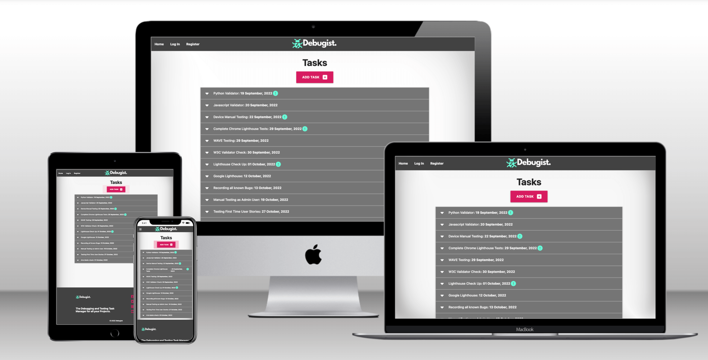

# Debugist -  Testing

Visit the deployed site: [Debugist](https://debugist-project.herokuapp.com/)

- - -

## CONTENTS

* [AUTOMATED TESTING](#AUTOMATED-TESTING)
    * [W3C Validator](#W3C-Validator)
    * [JavaScript Validator](#JavaScript-Validator)
    * [Python Validator](#Python-Validator)
    * [Lighthouse](#Lighthouse)
    * [WAVE Testing](#WAVE-Testing)
* [MANUAL TESTING](#MANUAL-TESTING)
    * [Testing User Stories](#Testing-User-Stories)
    * [Full Testing](#Full-Testing)
* [BUGS](#Bugs) 

Testing was ongoing throughout the build. I utilised Chrome developer tools whilst building to pinpoint and troubleshoot any issues as I went along.

I used the console in the developer tools to work through sections of code and ensure that it was working correctly, and also troubleshoot where needed.

I have gone through each page using google chrome developer tools to ensure that each page is responsive on a variety of different screen sizes and devices.

---

## AUTOMATED TESTING

### W3C Validator

[W3C](https://validator.w3.org/) was used to validate the HTML on all app pages. It was also used to validate the CSS file.

* tasks.html 
* register.html 
* login.html 
* profile.html 
* projects.html  
* add_project.html  
* edit_project.html 
* add_task.html  
* edit_task.html   

  * HTML:
  Get one warning for the 'flash banner' section, recommends to use a heading or change to a div from a 'section'.

  * CSS: 
  Warnings given for CDN linked libraries from FontAwesome and MaterializeCSS. These warnings did not affect linked elements I was using from those libraries. 

---

### JavaScript Validator

[jshint](https://jshint.com/) was used to validate the JavaScript.
I used the jshint extension I had installed into my Visual Studio Code IDE. 

No warnings given for the script.js file.

---

### Python Validator 

---

### Lighthouse

Google Lighthouse within the Chrome Developer Tools was used to test for performance, accessibility, best practices and SEO.

### Desktop Results

Results for the app based on desktop.

### Mobile Results

Results for the app for mobile. 

---

### WAVE Testing 

---

## MANUAL TESTING

### Testing User Stories

`First Time Visitor Goals`
| Goals | How are they achieved? |
| --- | --- |
|  |
| Question | Answer.| 
| Question | Answer.| 
| Question | Answer.| 
| Question | Answer.|
#

`Returning Visitor Goals`
| Goals | How are they achieved? |
| --- | --- |
|  |
| Question | Answer.| 
| Question | Answer.| 
| Question | Answer.| 
| Question | Answer.|
#

`Frequent Visitor Goals`
| Goals | How are they achieved? |
| --- | --- |
|  |
| Question | Answer.| 
| Question | Answer.| 
| Question | Answer.| 
| Question | Answer.|
#

---

### Full Testing

Full testing was performed on the following devices:

* Laptop:
  * Macbook Pro 2020 13 inch screen
  * Macbook Pro 2020 with external 27 inch monitor
* Mobile Devices:
  * iPhone 7 plus.
  * iPhone 6.

Each device tested the site using the following browsers:

* Google Chrome
* Safari
* Firefox

Additional testing was taken by friends and family on a variety of devices. 

* On small mobile devices such as the iPhone 6 the main logo section on the top nav bar gets cut off slightly, the logo also looks oversized for the screen. 
* It is not obvious to users that the home screen is also the page where to find current tasks. The home page should have been renamed to "Tasks" to make it more obvious.
* The flashing button animation for the "Add Task" button is annoying for some users and maybe should be removed. 
* It was not obvious to some users what the app was actually supposed to be used for and wanted at least an FAQ section. 
#

`Tasks Page`
| Feature | Expected Outcome | Testing Performed | Result | Pass/Fail |
| --- | --- | --- | --- | --- |
|  |  |  |  |  |
| Home Page Link | When clicked the user will be redirected to the home page.| Clicked link | Redirected to the home page. | Pass |
| Home Page Link | When clicked the user will be redirected to the home page.| Clicked link | Redirected to the home page. | Pass |
#

`Register Page`
| Feature | Expected Outcome | Testing Performed | Result | Pass/Fail |
| --- | --- | --- | --- | --- |
|  |  |  |  |  |
| Home Page Link | When clicked the user will be redirected to the home page.| Clicked link | Redirected to the home page. | Pass |
| Home Page Link | When clicked the user will be redirected to the home page.| Clicked link | Redirected to the home page. | Pass |
#

`Log In Page`
| Feature | Expected Outcome | Testing Performed | Result | Pass/Fail |
| --- | --- | --- | --- | --- |
|  |  |  |  |  |
| Home Page Link | When clicked the user will be redirected to the home page.| Clicked link | Redirected to the home page. | Pass |
| Home Page Link | When clicked the user will be redirected to the home page.| Clicked link | Redirected to the home page. | Pass |
#

`Profile Page`
| Feature | Expected Outcome | Testing Performed | Result | Pass/Fail |
| --- | --- | --- | --- | --- |
|  |  |  |  |  |
| Home Page Link | When clicked the user will be redirected to the home page.| Clicked link | Redirected to the home page. | Pass |
#

`Projects Page`
| Feature | Expected Outcome | Testing Performed | Result | Pass/Fail |
| --- | --- | --- | --- | --- |
|  |  |  |  |  |
| Home Page Link | When clicked the user will be redirected to the home page.| Clicked link | Redirected to the home page. | Pass |
| Home Page Link | When clicked the user will be redirected to the home page.| Clicked link | Redirected to the home page. | Pass |
| Home Page Link | When clicked the user will be redirected to the home page.| Clicked link | Redirected to the home page. | Pass |
#

`Edit Project Page`
| Feature | Expected Outcome | Testing Performed | Result | Pass/Fail |
| --- | --- | --- | --- | --- |
|  |  |  |  |  |
| Home Page Link | When clicked the user will be redirected to the home page.| Clicked link | Redirected to the home page. | Pass |
#

`Add Project Page`
| Feature | Expected Outcome | Testing Performed | Result | Pass/Fail |
| --- | --- | --- | --- | --- |
|  |  |  |  |  |
| Home Page Link | When clicked the user will be redirected to the home page.| Clicked link | Redirected to the home page. | Pass |
#

`Add Task Page`
| Feature | Expected Outcome | Testing Performed | Result | Pass/Fail |
| --- | --- | --- | --- | --- |
|  |  |  |  |  |
| Home Page Link | When clicked the user will be redirected to the home page.| Clicked link | Redirected to the home page. | Pass |
| Home Page Link | When clicked the user will be redirected to the home page.| Clicked link | Redirected to the home page. | Pass |
#

`Edit Task Page`
| Feature | Expected Outcome | Testing Performed | Result | Pass/Fail |
| --- | --- | --- | --- | --- |
|  |  |  |  |  |
| Home Page Link | When clicked the user will be redirected to the home page.| Clicked link | Redirected to the home page. | Pass |
| Home Page Link | When clicked the user will be redirected to the home page.| Clicked link | Redirected to the home page. | Pass |
#

`Base Template Sections`
| Feature | Expected Outcome | Testing Performed | Result | Pass/Fail |
| --- | --- | --- | --- | --- |
|  |  |  |  |  |
| Home Page Link | When clicked the user will be redirected to the home page.| Clicked link | Redirected to the home page. | Pass |
| Home Page Link | When clicked the user will be redirected to the home page.| Clicked link | Redirected to the home page. | Pass |
| Home Page Link | When clicked the user will be redirected to the home page.| Clicked link | Redirected to the home page. | Pass |
#

---

## BUGS

### Solved Bugs
| No | Bug | How I solved the issue |
| --- | --- | --- |
|  |  |
| 1 | Issue.| I solved it by... |
| 2 | Issue.| I solved it by... |
| 3 | Issue.| I solved it by... |
| 4 | Issue.| I solved it by... |
| 5 | Issue.| I solved it by... |
| 6 | Issue.| I solved it by... |
#

### Known Unresolved Bugs

* Bug 1.

* Bug 2.

* Bug 3.
#